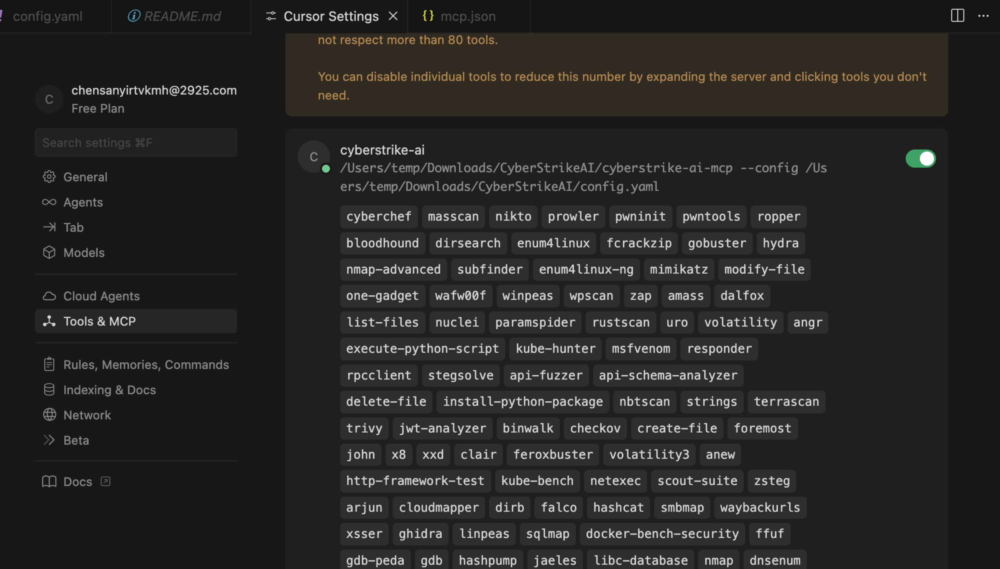

<div align="center">
  
</div>

# CyberStrikeAI

[中文](README_CN.md) | [English](README.md)

CyberStrikeAI 是一款 **AI 原生渗透测试协同体**，以 Go 编写，内置上百款安全工具，完整支持 MCP 协议，能够让智能体按照对话指令自主规划、执行并总结一次完整的安全测试流程。

- Web 控制台  
  
- MCP stdio 模式  
  
- 外部 MCP 服务器 & 攻击链视图  
     
  

## 特性速览

- 🤖 兼容 OpenAI/DeepSeek/Claude 等模型的智能决策引擎
- 🔌 原生 MCP 协议，支持 HTTP / stdio 以及外部 MCP 接入
- 🧰 100+ 现成工具模版 + YAML 扩展能力
- 📄 大结果分页、压缩与全文检索
- 🔗 攻击链可视化、风险打分与步骤回放
- 🔒 Web 登录保护、审计日志、SQLite 持久化

## 工具概览

系统预置 100+ 渗透/攻防工具，覆盖完整攻击链：

- **网络扫描**：nmap、masscan、rustscan、arp-scan、nbtscan
- **Web 应用扫描**：sqlmap、nikto、dirb、gobuster、feroxbuster、ffuf、httpx
- **漏洞扫描**：nuclei、wpscan、wafw00f、dalfox、xsser
- **子域名枚举**：subfinder、amass、findomain、dnsenum、fierce
- **API 安全**：graphql-scanner、arjun、api-fuzzer、api-schema-analyzer
- **容器安全**：trivy、clair、docker-bench-security、kube-bench、kube-hunter
- **云安全**：prowler、scout-suite、cloudmapper、pacu、terrascan、checkov
- **二进制分析**：gdb、radare2、ghidra、objdump、strings、binwalk
- **漏洞利用**：metasploit、msfvenom、pwntools、ropper、ropgadget
- **密码破解**：hashcat、john、hashpump
- **取证分析**：volatility、volatility3、foremost、steghide、exiftool
- **后渗透**：linpeas、winpeas、mimikatz、bloodhound、impacket、responder
- **CTF 实用工具**：stegsolve、zsteg、hash-identifier、fcrackzip、pdfcrack、cyberchef
- **系统辅助**：exec、create-file、delete-file、list-files、modify-file

## 基础使用

### 快速上手
1. **获取代码并安装依赖**
   ```bash
   git clone https://github.com/Ed1s0nZ/CyberStrikeAI.git
   cd CyberStrikeAI-main
   go mod download
   ```
2. **配置模型与鉴权**  
   启动后在 Web 端 `Settings` 填写，或直接编辑 `config.yaml`：
   ```yaml
   openai:
     api_key: "sk-your-key"
     base_url: "https://api.openai.com/v1"
     model: "gpt-4o"
   auth:
     password: ""                 # 为空则首次启动自动生成强口令
     session_duration_hours: 12
   security:
     tools_dir: "tools"
   ```
3. **按需安装安全工具（可选）**
   ```bash
   # macOS
   brew install nmap sqlmap nuclei httpx gobuster feroxbuster subfinder amass
   # Ubuntu/Debian
   sudo apt-get install nmap sqlmap nuclei httpx gobuster feroxbuster
   ```
   未安装的工具会自动跳过或改用替代方案。
4. **启动服务**
   ```bash
   chmod +x run.sh && ./run.sh
   # 或
   go run cmd/server/main.go
   # 或
   go build -o cyberstrike-ai cmd/server/main.go
   ```
5. **浏览器访问** http://localhost:8080 ，使用日志中提示的密码登录并开始对话。

### 常用流程
- **对话测试**：自然语言触发多步工具编排，SSE 实时输出。
- **工具监控**：查看任务队列、执行日志、大文件附件。
- **会话历史**：所有对话与工具调用保存在 SQLite，可随时重放。
- **可视化配置**：在界面中切换模型、启停工具、设置迭代次数等。

### 默认安全措施
- 设置面板内置必填校验，防止漏配 API Key/Base URL/模型。
- `auth.password` 为空时自动生成 24 位强口令并写回 `config.yaml`。
- 所有 API（除登录外）都需携带 Bearer Token，统一鉴权中间件拦截。
- 每个工具执行都带有超时、日志和错误隔离。

## 进阶使用

### 工具编排与扩展
- `tools/*.yaml` 定义命令、参数、提示词与元数据，可热加载。
- `security.tools_dir` 指向目录即可批量启用；仍支持在主配置里内联定义。
- **大结果分页**：超过 200KB 的输出会保存为附件，可通过 `query_execution_result` 工具分页、过滤、正则检索。
- **结果压缩/摘要**：多兆字节日志可先压缩或生成摘要再写入 SQLite，减小档案体积。

**自定义工具的一般步骤**
1. 复制 `tools/` 下现有示例（如 `tools/sample.yaml`）。
2. 修改 `name`、`command`、`args`、`short_description` 等基础信息。
3. 在 `parameters[]` 中声明位置参数或带 flag 的参数，方便智能体自动拼装命令。
4. 视需要补充 `description` 或 `notes`，给 AI 额外上下文或结果解读提示。
5. 重启服务或在界面中重新加载配置，新工具即可在 Settings 面板中启用/禁用。

### 攻击链分析
- 智能体解析每次对话，抽取目标、工具、漏洞与因果关系。
- Web 端可交互式查看链路节点、风险级别及时间轴，支持导出报告。

### MCP 全场景
- **Web 模式**：自带 HTTP MCP 服务供前端调用。
- **MCP stdio 模式**：`go run cmd/mcp-stdio/main.go` 可接入 Cursor/命令行。
- **外部 MCP 联邦**：在设置中注册第三方 MCP（HTTP/stdio），按需启停并实时查看调用统计与健康度。

### 自动化与安全
- **REST API**：认证、会话、任务、监控等接口全部开放，可与 CI/CD 集成。
- **任务控制**：支持暂停/终止长任务、修改参数后重跑、流式获取日志。
- **安全管理**：`/api/auth/change-password` 可即时轮换口令；建议在暴露 MCP 端口时配合网络层 ACL。

## 配置参考

```yaml
auth:
  password: "change-me"
  session_duration_hours: 12
server:
  host: "0.0.0.0"
  port: 8080
log:
  level: "info"
  output: "stdout"
mcp:
  enabled: true
  host: "0.0.0.0"
  port: 8081
openai:
  api_key: "sk-xxx"
  base_url: "https://api.deepseek.com/v1"
  model: "deepseek-chat"
database:
  path: "data/conversations.db"
security:
  tools_dir: "tools"
```

### 工具模版示例（`tools/nmap.yaml`）

```yaml
name: "nmap"
command: "nmap"
args: ["-sT", "-sV", "-sC"]
enabled: true
short_description: "网络资产扫描与服务指纹识别"
parameters:
  - name: "target"
    type: "string"
    description: "IP 或域名"
    required: true
    position: 0
  - name: "ports"
    type: "string"
    flag: "-p"
    description: "端口范围，如 1-1000"
```

## 项目结构

```
CyberStrikeAI/
├── cmd/                 # Web 服务、MCP stdio 入口及辅助工具
├── internal/            # Agent、MCP 核心、路由与执行器
├── web/                 # 前端静态资源与模板
├── tools/               # YAML 工具目录（含 100+ 示例）
├── img/                 # 文档配图
├── config.yaml          # 运行配置
├── run.sh               # 启动脚本
└── README*.md
```

## 基础体验示例

```
扫描 192.168.1.1 的开放端口
对 192.168.1.1 做 80/443/22 重点扫描
检查 https://example.com/page?id=1 是否存在 SQL 注入
枚举 https://example.com 的隐藏目录与组件漏洞
获取 example.com 的子域并批量执行 nuclei
```

## 进阶剧本示例

```
加载侦察剧本：先 amass/subfinder，再对存活主机进行目录爆破。
挂载基于 Burp 的外部 MCP，完成认证流量回放并回传到攻击链。
将 5MB nuclei 报告压缩并生成摘要，附加到对话记录。
构建最新一次测试的攻击链，只导出风险 >= 高的节点列表。
```

## Changelog（近期）

- 2025-11-20 —— 支持超大日志/MCP 记录的自动压缩与摘要回写。
- 2025-11-17 —— 上线 AI 驱动的攻击链图谱与风险评分。
- 2025-11-15 —— 提供大结果分页检索与外部 MCP 挂载能力。
- 2025-11-14 —— 工具检索 O(1)、执行记录清理、数据库分页优化。
- 2025-11-13 —— Web 鉴权、Settings 面板与 MCP stdio 模式发布。

---

欢迎提交 Issue/PR 贡献新的工具模版或优化建议！
